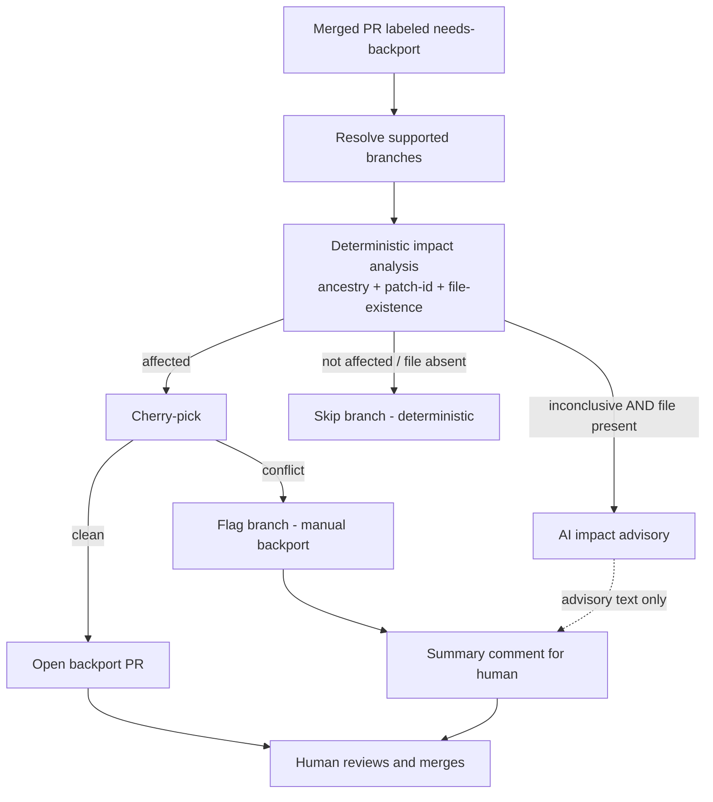

# AI in the Automated Backport Bot — Role & Validation

> Companion to `Automated-CVE-Branch-Resolution.md`. The main design doc deferred the
> AI details to "a separate design doc covering feasibility, guardrails, and a security
> review" — this is that doc. It explains, in plain terms, **what the AI does, where it
> sits, why it's safe, and how it was validated** in the proof-of-concept.

---

## 1. One-paragraph summary (read this first)

The backport decision is **fully deterministic**. The AI is a bounded **advisory second
opinion** used at exactly one point where the deterministic pipeline is inconclusive:
**impact analysis** when git-history ancestry can't confirm whether a branch is affected.
AI output is human-readable text attached to the pull request, so it is **never
committed, never auto-applied, and never overrides a deterministic verdict.** It exists
to turn the deterministic pipeline's *silent misses* into *human-reviewed advisories*.
Everything with a side effect (resolving branches, cherry-picking, opening PRs, posting
the summary) stays in the deterministic engine; the AI only answers the *affected / not
affected* question and hands its answer back for a human to read.

---

## 2. What the AI does (and does not)

| | Impact-analysis advisory |
|---|---|
| **Trigger** | Deterministic impact analysis is *inconclusive* for a branch (SHA ancestry **and** patch-id both fail) **and** at least one file the fix touches is present on the branch |
| **Why it's needed** | `git log -L` ancestry has a known blind spot: when a vulnerable line's history is obscured by a **rename** or a **heavy rewrite**, it can land on the wrong introducer and **silently mark a still-vulnerable branch "not affected"** — a false negative, the dangerous direction |
| **What it does** | Reads the fix diff + the branch's actual version of the affected file(s) and returns a verdict (affected / not / uncertain), a confidence level, and reasoning |
| **What it does NOT do** | Does **not** trigger a backport. The deterministic verdict stands; the AI assessment is attached to the PR comment for a human |

### Guardrails (why this is safe in a security-critical repo)
- **Advisory-only.** AI output is text in a PR comment. It has no write access, runs no commands, and cannot merge or push.
- **Impact analysis only.** The AI is consulted for the *affected / not affected* question and nothing else. It does not cherry-pick, open PRs, or resolve conflicts; those remain deterministic steps in `backport_bot.py`.
- **Never overrides deterministic findings.** The AI can only *add context* on branches the deterministic pipeline already marked "not affected" as inconclusive. It can never suppress a deterministic "affected."
- **Prompt-injection containment.** Even if attacker-influenced PR content manipulates the model, the worst case is a misleading advisory a human dismisses, as it cannot act.

### Where the AI sits in the pipeline



The dotted line is the only AI input, and it flows to a **human**, never to the
automation. When a cherry-pick conflicts, the bot aborts the pick and flags the branch
for a human engineer to backport by hand; the AI is not involved in that path.

---

## 3. What was built

- **One advisory function** in `scripts/backport_bot.py` (`ai_impact_analysis`), calling Claude on Amazon Bedrock via the Anthropic SDK. It is consulted only for impact analysis on inconclusive branches; every step with a side effect stays deterministic.
- **Rename-aware context gathering** — when a fix touches a file that was renamed, the bot resolves the file's *pre-rename* path on the target branch so the model can actually see the relevant code on older branches.
- **A deterministic file-existence short-circuit** — if a fix touches only files that don't exist on a branch (under any current or prior name), the branch is concluded "not affected" deterministically, and the AI is not consulted at all.
- **A local evaluation harness** (`scripts/visualize_ai_impact.py`) that runs the AI against the test fixture and scores it.

---

## 4. How it was tested

### 4.1 The test environment (a synthetic AWS-LC-like repo)

A small, fully controlled git fixture that mirrors the structure that makes real
backporting hard, while staying small enough to reason about and assign a known
ground truth:

- **7 release branches** — `AWS-LC-FIPS-2020` … `AWS-LC-FIPS-2025` and a one-off `NetOS` branch — each **forking from the mainline at a different point in history**, so older branches legitimately lack files that were added later.
- **A mid-history refactor** that renames files into subdirectories (`crypto.c → crypto/handshake.c`, `tls.c → tls/record.c`, `cert.c → tls/cert.c`, `digest.c → crypto/digest.c`) — to exercise rename tracking.
- **A divergent commit** on `FIPS-2024` (rewrites a function to use `strncpy` instead of `memcpy`) — to create diverged context that breaks clean cherry-picks.
- **An already-patched branch** (`FIPS-2025` cherry-picks one fix under a *new* commit SHA) — to test the "fix is already present" case.
- **A one-off branch** (`NetOS` adds a debug-logging line) — another form of divergence.

**Why synthetic:** it lets us encode a precise ground truth and *deliberately build the
hard cases* (renames, multi-file fixes, already-patched, code introduced in different
eras) that stress both the deterministic and the AI paths — something a real repo
snapshot can't give us reproducibly.

### 4.2 The test scenarios (7 security-style fixes)

Each scenario is a real fix commit on the mainline; the test asks, for every branch,
"is this branch affected?"

| Scenario | The fix | What it deliberately stresses |
|---|---|---|
| `cve-buffer` | NULL guards in `utils/buffer.c` (the oldest file, present on every branch) | Baseline / universal applicability |
| `cve-handshake-original` | Bounds check in `crypto.c` (pre-refactor path) | File present only from 2021; **absent on 2020**; **already-patched on 2025** |
| `cve-handshake-postrefactor` | NULL guards in `crypto/handshake.c` (post-refactor path) | **Rename tracking** — the code lives at `crypto.c` on older branches |
| `cve-record-multifile` | NULL/length guards in `tls/record.c` + `tls/cert.c` | **Multi-file fix + renames**; `cert.c` exists only from 2023 |
| `cve-pure-modification` | Constant-time `hash_compare` in `crypto/digest.c` | Pure line *modification*; file exists only from 2024 |
| `cve-pure-deletion` | Remove a vulnerable `verify_signature` stub | Deletion-type fix; rename tracking |
| `cve-cross-era` | Guards in `utils/buffer.c` (universal) **+** `crypto/digest.c` (2024+) | **Multi-file across very different introduction eras — the deterministic false-negative trap** |

### 4.3 Ground truth

For every (scenario × branch) pair we recorded the answer an experienced reviewer would
give after reading the branch — "does the underlying buggy code actually exist here,
unfixed?" This is the gold standard both the deterministic check and the AI are scored
against. 7 scenarios × 7 branches = **49 decisions**.

### 4.4 Methodology

`scripts/visualize_ai_impact.py` runs, for each (scenario × branch):
1. the **deterministic** verdict (`git log -L` ancestry + patch-id),
2. the **AI** advisory verdict + full reasoning, and
3. the **ground-truth** answer,

then tallies AI-vs-truth and a head-to-head deterministic-vs-AI comparison. This is what
let us measure the AI's value precisely rather than by anecdote.

---

## 5. Results

| Metric (over 49 branch × scenario decisions) | Deterministic baseline | AI advisory |
|---|---|---|
| Accuracy on decisive verdicts | 87.8% | **100%** |
| **False negatives** (vulnerable branch silently skipped) | **5** | **0** |
| False positives (unnecessary flag) | 1 | 0 |
| Regressions introduced by the AI | — | **0** |

**Head-to-head:** the AI **caught all 5 of the deterministic check's silent false
negatives** (the `cve-cross-era` branches + `cve-record-multifile / FIPS-2022`), cleared
the 1 false positive (the already-patched `FIPS-2025`), and introduced **zero
regressions**. Net effect: **+6 corrected decisions**.

**Two engineering findings that mattered:**
1. **Rename-aware context doubled the AI's coverage.** Before it could read pre-rename files, the AI returned "uncertain" on 29 of 49 cases (it had no code to look at). After, decisive coverage went 20 → 40.
2. **File-existence is a deterministic signal, not an AI question.** When a fix's files don't exist on a branch at all, the bot now concludes "not affected" directly. This removed the last 9 "uncertain" AI answers (9 → 0) and avoids 9 needless model calls per run.

**Net picture:** the deterministic pipeline is fast and safe-by-construction but has a
small set of *silent* false negatives around renames and multi-era fixes; the AI
advisory closes exactly that gap, as a human-reviewed suggestion, without ever overriding
a deterministic decision.

---

## 6. How to reproduce

Requires local AWS Bedrock access (`aws sts get-caller-identity` must succeed) and the
SDK (`pip install "anthropic[bedrock]"`).

```sh
export AWS_REGION=us-east-2                 # region with your Bedrock model access
export BEDROCK_MODEL_ID=us.anthropic.claude-opus-4-8   # optional model override

python3 scripts/visualize_ai_impact.py --all          # every scenario, all branches
python3 scripts/visualize_ai_impact.py cve-cross-era  # the false-negative-rescue case
```

The run prints, per branch, the deterministic verdict, the AI verdict + reasoning, and
the ground truth, ending with an "AI vs ground truth" tally and a
"deterministic vs AI" head-to-head.
